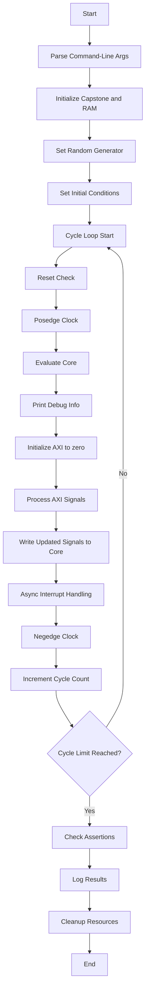

```mermaid
flowchart TD
    A[Start] --> B[Parse Command-Line Args]
    B --> C[Initialize Capstone and RAM]
    C --> D[Set Random Generator]
    D --> E[Set Initial Conditions]
    E --> F[Cycle Loop Start]
    
    F --> G[Reset Check]
    G --> H[Posedge Clock]
    H --> I[Evaluate Core]
    I --> J[Print Debug Info]
    J --> K[Initialize AXI to zero]
    K --> L[Process AXI Signals]
    L --> M[Write Updated Signals to Core]
    M --> N[Async Interrupt Handling]
    N --> O[Negedge Clock]
    O --> P[Increment Cycle Count]
    P --> Q{Cycle Limit Reached?}
    
    Q -- No --> F
    Q -- Yes --> R[Check Assertions]
    R --> S[Log Results]
    S --> T[Cleanup Resources]
    T --> U[End]
```